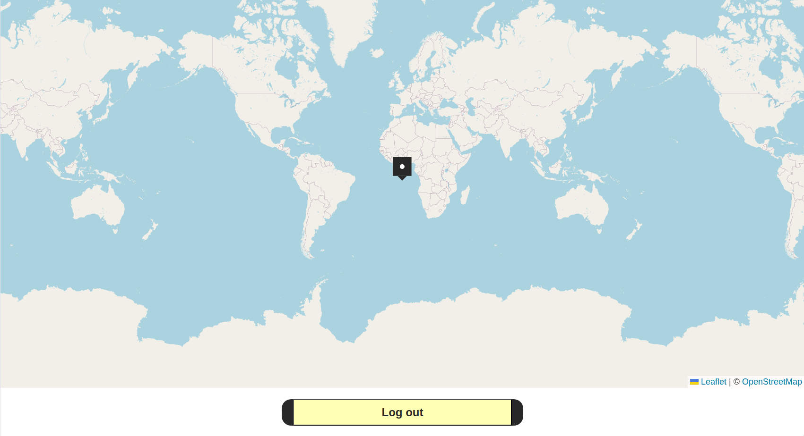

# mtrack/frontend

[![GPL licensed][license-badge]][license-url]

[license-badge]: https://img.shields.io/badge/license-GPL-blue.svg
[license-url]: ./package.json

The frontend of [mtrack](https://github.com/shtsoft/mtrack).

### Installation

Having a clone of the [mtrack repo](https://github.com/shtsoft/mtrack), generate the (servable) `dist` directory by running the following commands in the context of the repo top-level:

```console
user@host:~$ cd frontend
user@host:~$ npm install
user@host:~$ npm run build
```

Then copy the resulting directory `dist` to the appropriate location.

### Usage

To properly serve mtrack, you have to use the [backend](../backend).

However, for a quick view in the browser, you can serve the `dist` directory locally on `http://127.0.0.1:8080` with

```console
user@host:~$ npm run serve
```

### Screenshots

#### Home Page

> 

#### Login Page

> 

#### Postpos Page

> 

#### Tracker Page 1

> 

#### Tracker Page 2

> 

## Contributing

If you want to contribute: [CONTRIBUTING](CONTRIBUTING.md).

### Security

For security-related issues see: [SECURITY](../SECURITY.md).
